# NEXUS·3 end user guide

Everything you can click, drag, turn or type, with a picture of each part.

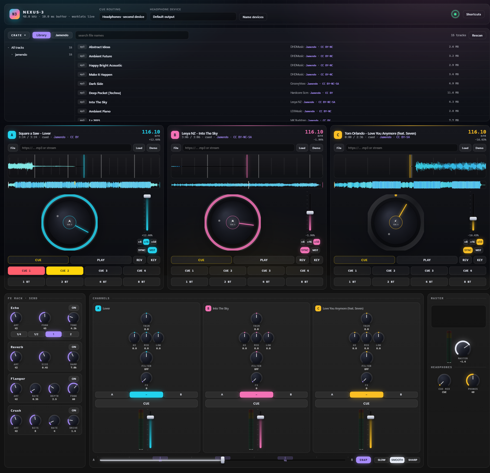

* [Section 1: quick guide](#section-1-quick-guide)
* [Section 2: element guide](#section-2-element-guide)
  * [Layout map](#layout-map)
  * [1. Boot screen](#1-boot-screen)
  * [2. Top bar](#2-top-bar)
  * [3. Library index ring](#3-library-index-ring)
  * [4. Shortcuts panel](#4-shortcuts-panel)
  * [5. Crate](#5-crate)
  * [6. Deck](#6-deck)
  * [7. FX rack](#7-fx-rack)
  * [8. Channels](#8-channels)
  * [9. Master and headphones](#9-master-and-headphones)
  * [Universal control behaviour](#universal-control-behaviour)

---

# Section 1: quick guide

## Start the app

```bash
npm start
```

Open <http://localhost:5173>. To use your own music folder instead of the bundled one:

```bash
npm start -- --music "D:\songs"
```

> The app must be served over HTTP. Double-clicking `index.html` will not work.

## First sound in 10 seconds

1. Click **Enter the booth**. Browsers block audio until you click something, this is that click.
2. On deck A, click **Demo**. A house loop is generated and beat-analysed on the spot.
3. Press **PLAY**.
4. Raise deck A's volume fader in the **Channels** box if you hear nothing.

## Your first mix in 2 minutes

| Step | Do this | Why |
| --- | --- | --- |
| 1 | **Demo** on decks A and B, **PLAY** on A | A track is running out front |
| 2 | Set deck A's channel assign to **A**, deck B's to **B** | Both are now under crossfader control |
| 3 | Push the crossfader fully left | Only deck A is heard |
| 4 | **PLAY** deck B, then **SYNC** on deck B | B matches A's tempo and beat grid |
| 5 | Slide the crossfader to the right | B fades in, on beat |
| 6 | Sweep deck A's **FILTER** knob right while you fade | Classic high-pass exit |
| 7 | Click **ON** on the **Echo** FX unit, turn deck B's **FX** knob up | Beat-synced echo on B |

## Cueing in headphones

1. Set **Cue routing** in the top bar to *Headphones · second device*.
2. Press **Name devices** once so the browser reveals device names, then pick your headphones.
3. Press the **CUE** button on the channel you want to pre-listen to.
4. Turn **CUE MIX** toward `CUE` and raise **PHONES**.

The audience keeps hearing the master mix, you hear the cued channel.

## Loading your own music

| You have | Do this |
| --- | --- |
| A music folder | Start with `--music "D:\songs"`, then browse the **Library** tab of the crate |
| A single file | Press **File** on a deck, or drag the file onto the deck |
| A URL to an mp3 | Paste it in the deck's URL box, press **Load** |
| A radio stream | Paste the stream URL, press **Load**. Plays, but cannot be scratched or beat-gridded |
| Nothing yet | Use **Demo**, or the **Jamendo** tab for free Creative Commons tracks |

## Keyboard cheat sheet

| Keys | Action |
| --- | --- |
| <kbd>1</kbd> <kbd>2</kbd> <kbd>3</kbd> | Play / pause deck A, B, C |
| <kbd>Q</kbd> <kbd>W</kbd> <kbd>E</kbd> | Cue, hold to preview, release to jump back |
| <kbd>A</kbd> <kbd>S</kbd> <kbd>D</kbd> | Toggle sync on deck A, B, C |
| <kbd>Z</kbd> <kbd>X</kbd> <kbd>C</kbd> | Toggle headphone cue (PFL) on channel A, B, C |
| <kbd>←</kbd> <kbd>→</kbd> | Nudge the crossfader |
| <kbd>Shift</kbd> (held) | Fine mode while dragging a knob or fader |
| <kbd>?</kbd> | Open / close the shortcuts panel |
| <kbd>Esc</kbd> | Close the shortcuts panel, or clear the crate search |

Shortcuts are ignored while you are typing in a text box.

## Five things worth knowing

* **Double-click any knob or fader** to reset it to its default.
* **Hold Shift while dragging** for fine adjustment.
* A track is always downloaded and decoded in full before it plays. That is why scratching is exact.
* Moving the pitch fader by hand turns **SYNC** off on that deck.
* If a channel makes no sound, check its **volume fader**, its **A / – / B** assign and the **crossfader**.

---

# Section 2: element guide

## Layout map

The console is a stack of boxes, top to bottom:

| Box | Purpose |
| --- | --- |
| [Top bar](#2-top-bar) | Engine status, headphone routing, index ring, shortcuts |
| [Crate](#5-crate) | Track browser: your library and the Jamendo catalogue |
| [Decks A, B, C](#6-deck) | Three identical players |
| [FX rack](#7-fx-rack) | Four master send effects |
| [Channels](#8-channels) | Three mixer strips and the crossfader |
| [Master](#9-master-and-headphones) | Output level, spectrum, headphone controls |

---

## 1. Boot screen

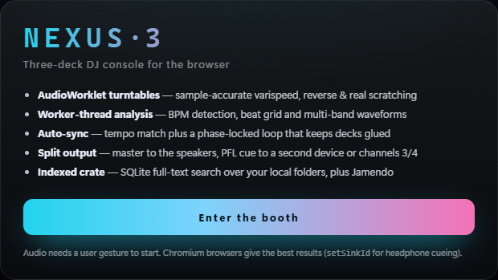

The first thing you see. Browsers refuse to start audio without a user gesture, so the app waits here.

| Element | What it does |
| --- | --- |
| **Enter the booth** | Creates the `AudioContext`, loads the DSP worklets and reveals the console |

Nothing else on this screen is interactive.

---

## 2. Top bar

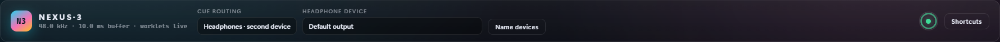

Always visible, three groups: identity on the left, routing in the middle, tools on the right.

### Identity

| Element | What it does |
| --- | --- |
| **N3** badge / **NEXUS·3** | Branding, not clickable |
| Status line under the name | Live engine readout: sample rate, output buffer size in ms and worklet state. Reads `audio engine idle` before you enter the booth |

### Cue routing


| Element | What it does |
| --- | --- |
| **Cue routing** dropdown | Chooses where the headphone mix goes. See the table below |
| **Headphone device** dropdown | Which output device receives the cue mix. Only meaningful in *Headphones · second device* mode |
| **Name devices** | Asks for microphone permission for a split second, purely so the browser will reveal output device *names*. Without it the list shows anonymous IDs. Permission is released immediately |

| Routing mode | Behaviour |
| --- | --- |
| **Headphones · second device** | Master keeps playing on the default device, the cue mix is pushed to the device you picked. Chromium only |
| **Split 4-channel · out 3/4** | For multi-channel interfaces: master on outputs 1/2, cue on outputs 3/4. Falls back automatically if the device is stereo only |
| **Master only** | No separate cue path, the CUE buttons do nothing audible |

### Tools


| Element | What it does |
| --- | --- |
| Index ring | Library scan status, see below |
| **Shortcuts** | Opens the keyboard and mouse reference |

---

## 3. Library index ring


A small ring in the top bar. It spins while your music folder is being indexed and its tooltip shows the
current track count. Scanning happens on a background thread, so you can browse and mix while it runs.

Click it to open the details panel:

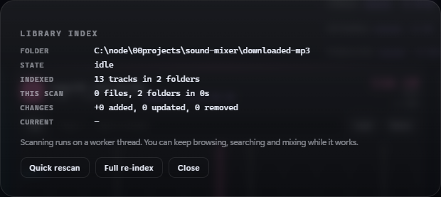

| Row | Meaning |
| --- | --- |
| **Folder** | The library root currently indexed |
| **State** | `idle`, `scanning`, or an error message |
| **Indexed** | Total tracks and folders in the index |
| **This scan** | Files and folders touched by the current or last scan, plus elapsed time |
| **Changes** | Added, updated and removed counts |
| **Current** | The file being processed right now |

| Button | What it does |
| --- | --- |
| **Quick rescan** | Incremental scan, skips folders whose modification time has not changed. Fast |
| **Full re-index** | Re-reads every folder and file. Use it if something looks stale |
| **Close** | Closes the panel. Clicking the dimmed background also closes it |

---

## 4. Shortcuts panel

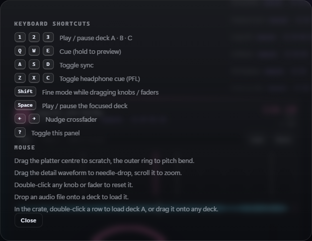

Opened by the **Shortcuts** button or the <kbd>?</kbd> key, closed by **Close** or <kbd>Esc</kbd>.
It is a reference only, nothing in it is clickable except **Close**.

---

## 5. Crate

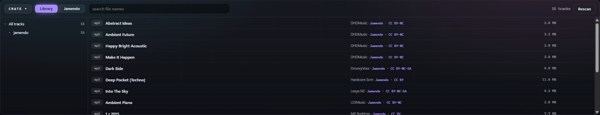

The track browser. Rows are virtualised, so a million tracks scroll as smoothly as fifty.

### Crate bar

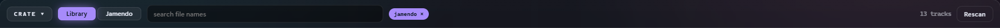

| Element | What it does |
| --- | --- |
| **CRATE ▾** | Collapses and expands the whole browser, to give the decks more room |
| **Library** tab | Browses your indexed music folder |
| **Jamendo** tab | Searches the Jamendo Creative Commons catalogue |
| Search box | Full text search. Library mode searches file names, folder paths and tags, and every word is treated as a prefix, so `mid dee` finds *Midnight Deep Cut*. <kbd>Esc</kbd> clears it |
| Folder chip | Appears once you select a folder in the tree, showing the active scope. Click it to clear the scope |
| Track count | Number of tracks matching the current scope and search |
| **Client ID** | Jamendo tab only, opens the API key panel |
| **Rescan** | Triggers an incremental re-index of the library folder |

### Folder tree

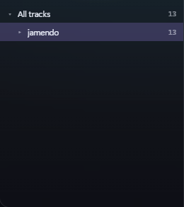

| Element | What it does |
| --- | --- |
| **All tracks** | The library root, selecting it removes any folder scope |
| Twisty (`▸` / `▾`) | Expands or collapses a folder. Children are loaded on demand, and your open folders are remembered between visits |
| Folder name | Click to scope the list and the search to that folder |
| Number on the right | Recursive track count, everything beneath that folder, not just its direct children |

Selecting a folder lists **everything below it**, so you never have to walk down a deep tree to see its music.

### Track row

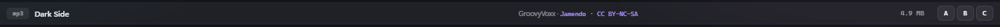

| Element | What it does |
| --- | --- |
| Format badge (`mp3`, `flac`, …) | File type |
| Title | Track title from tags, otherwise the file name |
| Sub line | Artist and folder. For provider tracks it shows the provider and licence, and the licence text links to the original track page |
| Right hand value | Track duration, or file size when the duration is not known yet |
| **A** **B** **C** | Load this track straight onto that deck |

| Gesture | Result |
| --- | --- |
| Double-click the row | Load onto deck A |
| Drag the row onto a deck | Load onto that deck |
| Click the licence link | Opens the track's page in a new tab |

Tags are read lazily for the rows currently on screen, so a title may sharpen up a moment after it appears.

### Jamendo tab

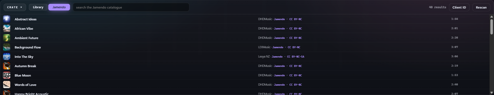

Same list, same load actions, sourced from [Jamendo](https://www.jamendo.com/). Rows show cover art,
artist, licence and a link back to the track page. Results load more as you scroll.

Jamendo tracks get the **full** deck feature set (scratching, beat grid, loops, keylock) because the audio is
downloaded and decoded locally. Each loaded track is also archived into your library folder, so next time it
is a local file.

Tracks under a **NoDerivatives** licence are excluded, since mixing creates a derivative work.

### Jamendo client ID

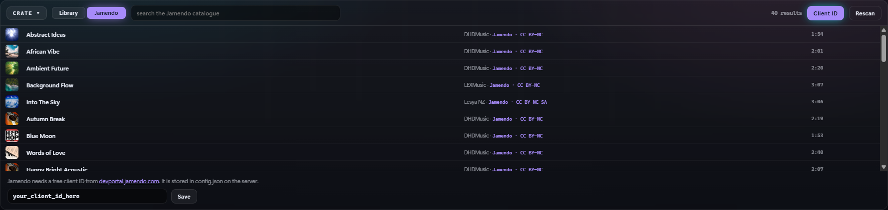


The Jamendo tab needs a free `client_id` from [devportal.jamendo.com](https://devportal.jamendo.com/).
The panel opens by itself while no key is set, and the **Client ID** button reopens it later.

| Element | What it does |
| --- | --- |
| `client_id` text box | Paste your key here. <kbd>Enter</kbd> saves it |
| **Save** | Stores the key, then reloads the results. Saving an empty box clears the key |
| Status text | `saved`, `cleared`, or the error returned by the server |

The key is written to `config.json` next to the app, which is gitignored and not reachable over HTTP.

---

## 6. Deck

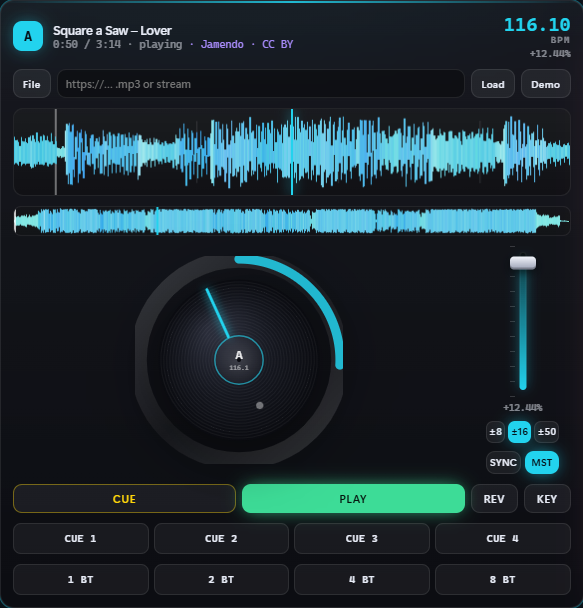

Three identical decks, A (cyan), B (pink) and C (amber). Everything below exists once per deck.

Drop an audio file anywhere on a deck to load it.

### Deck header

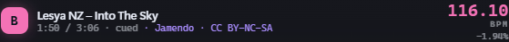

| Element | What it does |
| --- | --- |
| Letter badge | The deck's identity and colour |
| Track name | `Artist – Title`, or `No track loaded` |
| Time readout | Current position / total length |
| State | `playing`, `cued`, or `stream` for live streams |
| Licence link | Provider and licence for crate tracks that carry one, links back to the source page |
| Big number | Effective BPM, that is the detected tempo after the pitch fader is applied |
| **BPM** / percentage | The pitch offset currently applied, for example `+2.41%` |

Nothing in the header is a control, it is all readout.

### Loader row

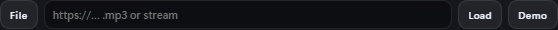

| Element | What it does |
| --- | --- |
| **File** | Opens a file picker for any audio file your browser can decode |
| URL box | Paste a direct audio URL or a stream URL. <kbd>Enter</kbd> loads it |
| **Load** | Loads whatever is in the URL box. A URL ending in an audio extension is downloaded and analysed, anything else is treated as a live stream |
| **Demo** | Generates a demo loop on the spot: 124 BPM house on A, 128 BPM techno on B, 96 BPM hip-hop on C |

### Loading progress

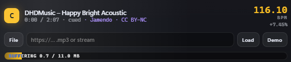

Appears only while a track is loading, and reports each phase:
`buffering 2.1 / 5.4 MB`, then `decoding`, then `analysing beat grid`. Tracks you have played before
report `from cache` and skip analysis entirely.

### Detail waveform

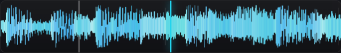

The scrolling close-up around the playhead, coloured by frequency band (bass, mids, highs). Vertical lines
are the detected beat grid, and the brighter line is the downbeat.

| Gesture | Result |
| --- | --- |
| Drag left or right | Needle-drop, scrub through the track |
| Scroll wheel | Zoom the time window in or out |

### Overview waveform

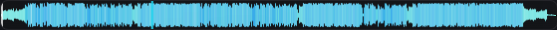

The whole track at a glance, with the playhead and your hot cue markers.

| Gesture | Result |
| --- | --- |
| Click or drag | Jump to that point in the track |

### Platter and pitch

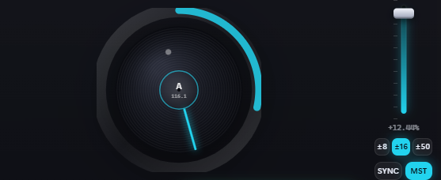

#### Jog wheel

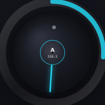

A real turntable simulation with motor inertia, so it spins up and brakes rather than snapping.
The pointer line shows platter rotation, the small dot marks the track position, and the coloured arc is
the elapsed portion of the track.

| Gesture | Result |
| --- | --- |
| Drag the **centre** | Scratch, including full reverse playback |
| Drag the **outer ring** | Pitch bend, a temporary speed nudge like a hand on the record edge. Speed returns to normal when you let go |

#### Side column

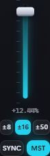

| Element | What it does |
| --- | --- |
| Pitch fader | Speeds the track up or slows it down. Reads out as a percentage. Double-click to return to 0.00%. Moving it turns **SYNC** off |
| **±8 / ±16 / ±50** | The pitch fader's range. Wider range, coarser control. Sync widens this automatically when it needs more room |
| **SYNC** | Matches this deck's tempo and beat grid to the sync master, then keeps it locked with a phase-locked loop. Half and double time are tried too, so a 128 BPM track will lock to a 64 BPM one |
| **MST** | Makes this deck the sync master that the others follow. Click again to release. Without an explicit master, the first playing deck with a beat grid takes the role |

### Transport


| Button | What it does |
| --- | --- |
| **CUE** | Hold to preview from the cue point, release to jump back and stop. Pressing it while stopped sets the cue point at the current position |
| **PLAY** | Play / pause. Lights up while playing |
| **REV** | Reverse playback. Toggle |
| **KEY** | Keylock, or master tempo: the pitch fader changes speed without changing musical key. Toggle |

### Hot cues


Four coloured pads, red, yellow, green and blue.

| Gesture | Result |
| --- | --- |
| Click an unlit pad | Store a hot cue at the current position |
| Click a lit pad | Jump to that hot cue instantly |
| Shift-click, or right-click | Clear that hot cue |

Stored hot cues also show up as markers on the overview waveform.

### Loop pads


| Button | What it does |
| --- | --- |
| **1 BT** | Loop one beat from the current position |
| **2 BT** | Loop two beats |
| **4 BT** | Loop four beats, one bar |
| **8 BT** | Loop eight beats, two bars |

Clicking the pad of an active loop exits the loop. Clicking a different size re-loops at the new length.
Loop lengths follow the deck's detected tempo, so they stay musical when you move the pitch fader.

---

## 7. FX rack

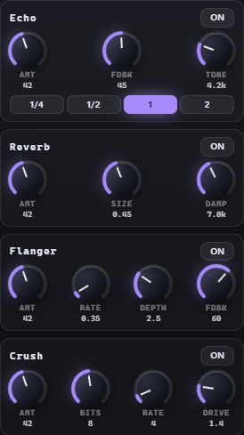

Four master effects on a **send** bus. Nothing is heard from the rack until you turn up a channel's
**FX** knob, so arming an effect is always safe.

### Anatomy of an FX unit

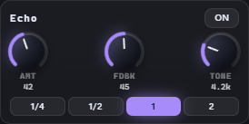

| Element | What it does |
| --- | --- |
| Unit name | Echo, Reverb, Flanger or Crush |
| **ON** | Arms the effect. Off means it is fully bypassed |
| **AMT** | How much of that effect reaches the master. The unit's wet level |

### Unit parameters

| Unit | Knob | What it does |
| --- | --- | --- |
| **Echo** | **FDBK** | Feedback: how many repeats you get before the echo dies away |
| | **TONE** | Darkens or brightens the repeats with a low-pass filter |
| | **1/4 · 1/2 · 1 · 2** | Delay time in beats, locked to the sync master's tempo |
| **Reverb** | **SIZE** | Length of the reverb tail, small room to big hall |
| | **DAMP** | High frequency damping, lower values give a darker, softer tail |
| **Flanger** | **RATE** | Sweep speed of the flanger |
| | **DEPTH** | How far the sweep travels, the intensity of the jet sound |
| | **FDBK** | Feedback, higher values make it more metallic and resonant |
| **Crush** | **BITS** | Bit depth. Fewer bits means grittier and noisier |
| | **RATE** | Sample rate reduction, higher values sound more lo-fi and aliased |
| | **DRIVE** | Input saturation before the crushing |

---

## 8. Channels

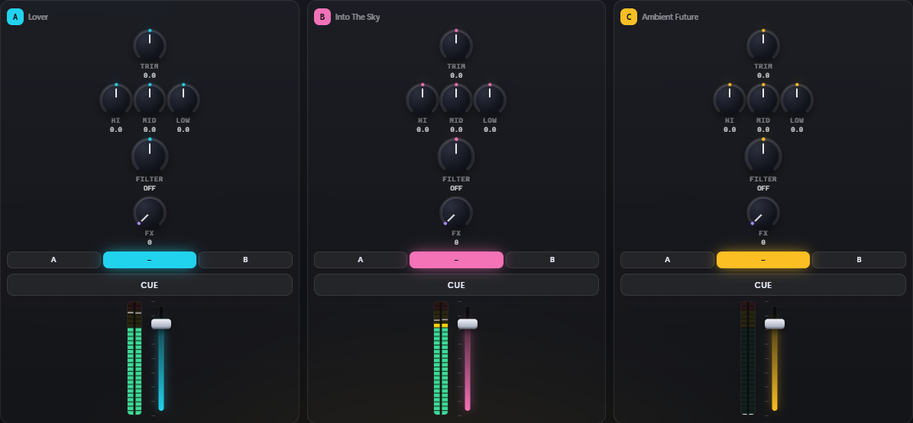

One strip per deck, plus the crossfader row underneath.

### Channel strip

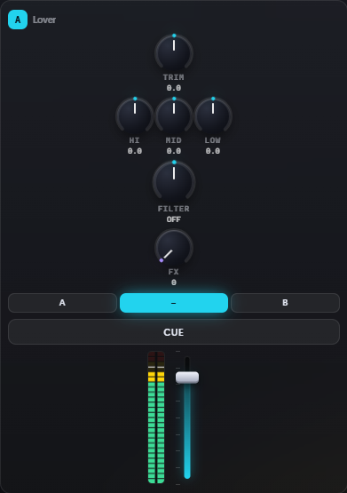

Top to bottom, in signal order:

| Element | What it does |
| --- | --- |
| Header | Deck letter and the loaded track's title, or `empty` |
| **TRIM** | Input gain in dB, used to match the loudness of different tracks before the fader. Centre is unity |
| **HI** | High shelf, boost or cut. Full left is a kill |
| **MID** | Mid band, boost or cut. Full left is a kill |
| **LOW** | Low band, boost or cut. Full left is a kill, the usual way to swap basslines |
| **FILTER** | A single bipolar colour filter. Left sweeps a low-pass down, right sweeps a high-pass up, and resonance rises toward the extremes. Centre reads `OFF` |
| **FX** | How much of this channel is sent to the FX rack |
| **A / – / B** | Crossfader assign. `A` means this channel is heard at the left end, `B` at the right end, `–` bypasses the crossfader so the channel is always heard |
| **CUE** | Pre-fader listen. Sends this channel to the headphones regardless of the fader and crossfader. Lights up when armed |
| Level meter | Post-fader level for this channel, peak and RMS |
| Volume fader | Channel level. Starts at 80%, double-click resets it there |

Boosting EQ is roughly `+6 dB` at the top, cutting goes all the way to silence, which is why the knob feels
asymmetric: that matches how a club mixer behaves.

### Crossfader row

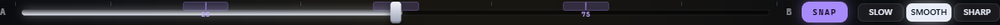

| Element | What it does |
| --- | --- |
| **A** / **B** labels | Which end belongs to which assign group |
| Crossfader | Blends the A group against the B group. Channels assigned `–` ignore it. Nudge with <kbd>←</kbd> and <kbd>→</kbd>, double-click to centre |
| **SNAP** | When lit, the crossfader clicks into 25%, 50% and 75% when you release it. Turn it off for free movement |
| **SLOW** | Gentle curve, a long overlapping blend, good for long mixes |
| **SMOOTH** | Balanced constant-power curve, the default |
| **SHARP** | Fast cut curve, the channel arrives almost immediately, for cutting and scratching |

---

## 9. Master and headphones

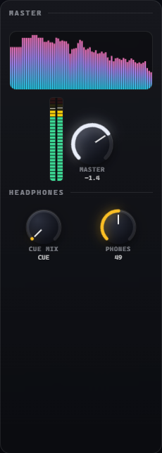

| Element | What it does |
| --- | --- |
| Spectrum display | Live frequency analysis of the master output, readout only |
| Master meter | Master level, peak and RMS, measured after the limiter |
| **MASTER** | Master output level, shown in dB. Double-click resets to the default |

### Headphones

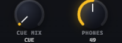

| Element | What it does |
| --- | --- |
| **CUE MIX** | Blends what you hear in the headphones. Fully left reads `CUE`, only the channels you armed with **CUE**. Fully right reads `MST`, only the master mix. Anything between is a blend |
| **PHONES** | Headphone output level |

These only do something audible when **Cue routing** in the top bar is set to a mode other than *Master only*.

---

## Universal control behaviour

Every knob and fader in the app behaves the same way:

| Gesture | Result |
| --- | --- |
| Drag up / down (knobs and vertical faders) | Change the value |
| Drag left / right (horizontal faders) | Change the value |
| Hold <kbd>Shift</kbd> while dragging | Fine mode, much smaller steps |
| Double-click | Reset to the default value |
| Scroll wheel over the control | Step the value up or down |

Segmented buttons (`±8 / ±16 / ±50`, `A / – / B`, `SLOW / SMOOTH / SHARP`, the echo divisions) are
single-choice: clicking one option deselects the others. Toggle buttons (**PLAY**, **SYNC**, **MST**,
**KEY**, **REV**, **CUE**, **ON**, **SNAP**) light up while active.

### Toast messages

Short notices slide in at the bottom of the screen when a track finishes loading, when a load fails, when
cue routing changes, or when a stream cannot be scratched. They disappear on their own.

---

## Troubleshooting

| Symptom | Cause and fix |
| --- | --- |
| No sound at all | You skipped **Enter the booth**, or the channel fader, the **A / – / B** assign or the crossfader is muting the channel |
| Headphone device list shows codes, not names | Press **Name devices** in the top bar and accept the permission prompt |
| No **Headphones · second device** option working | That routing needs a Chromium browser, Firefox is partial and Safari has no support |
| BPM shows `--.-` | The track is a live stream, or analysis has not finished. Streams cannot be beat-gridded |
| Scratching does nothing | The deck is in stream mode, there is no decoded buffer to scratch |
| **SYNC** does not lock | Both decks need a beat grid. Tempo detection targets steady 4/4 material |
| Keylock sounds grainy | Expected beyond roughly ±10%, that is the nature of time-domain pitch shifting |
| The crate is empty | Check the index ring, the scan may still be running, or the `--music` folder has no audio files |
| Jamendo tab says a key is needed | Press **Client ID** and paste a free key from devportal.jamendo.com |

---

Deeper technical detail, server flags and the audio architecture live in the [README](README.md).
