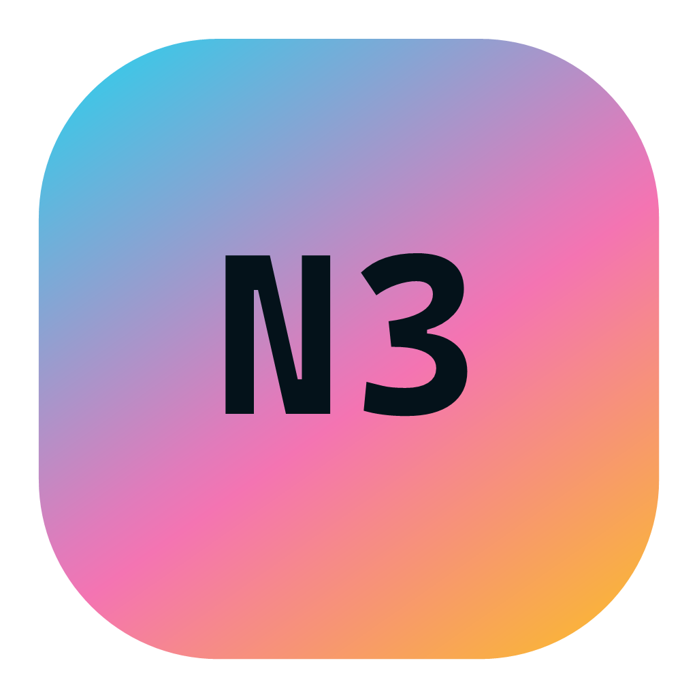
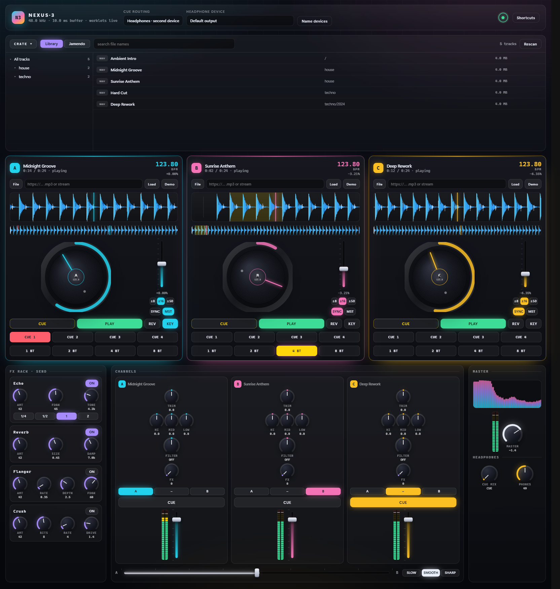
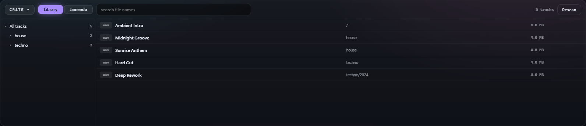

#  NEXUS·3: HTML5 DJ Mixing Table

A three-deck DJ console that runs entirely in the browser. No build step, no dependencies, no
frameworks, just modern web audio: `AudioWorklet` DSP on the render thread, track analysis on a
`Worker` thread, a SQLite indexed crate over your own music folders, and a second audio output for
headphone cueing.



> [!NOTE]
> **New here?** [Howto-EndUser.md](Howto-EndUser.md) is the end user guide: a quick start, then every
> box and every control documented with screenshots. This README covers setup, flags and internals.

> [!TIP]
> Try it out in Chromium: https://qxsch.github.io/Nexus3/
> (Web version has limited features and they also depend on browser support)

---

## Quick start

```bash
git clone https://github.com/qxsch/Nexus3.git
cd Nexus3
npm start
```

Then open <http://localhost:5173> and click **Enter the booth**.

`npm start` runs [server.js](server.js), a static file server plus a small library API built on
`node:http` and the built in `node:sqlite`. There is nothing to install, `package.json` has no
dependencies. **Node 22.5 or newer is required** for `node:sqlite`; Node 24 is what this was
developed against.

Point it at your own music folder:

```bash
npm start -- --music "D:\songs"
```

Without that flag it indexes [downloaded-mp3/](downloaded-mp3), which is also where Jamendo
downloads are archived. Subfolders are scanned recursively.

> **You must serve the app over HTTP.** Opening `index.html` from `file://` will not work:
> `AudioWorklet.addModule()` and module workers require a secure origin, and `localhost` counts as one.

Any other static server works too, as long as it sends `.js` with a JavaScript MIME type:

```bash
npx serve .          # or
python -m http.server 5173
```

Note that the crate, the library index and the Jamendo archive need `server.js`; a plain static
server gives you the decks and the mixer only.

### First sound in 10 seconds

1. Click **Enter the booth** (browsers require a user gesture before audio can start).
2. Click **Demo** on deck A. A house loop is synthesised offline and analysed for BPM.
3. Hit **PLAY**.
4. Click **Demo** on decks B and C, press **PLAY**, then **SYNC** on each. All three lock to deck A's grid.
5. Drag the crossfader, sweep the **FILTER** knobs, arm **Echo** in the FX rack and turn up a channel's **FX** send.

For a control-by-control walkthrough with screenshots, see the [end user guide](Howto-EndUser.md).

---

## Desktop app

The same code also ships as a native app. An Electron shell starts [server.js](server.js)'s engine
in-process, binds it to `127.0.0.1` on an ephemeral port and points a Chromium window at it, so the
decks, the crate and the second output device behave exactly as they do in the browser. There is no
auto-updater: new versions are installed with the package.

| Platform | Package | Notes |
| --- | --- | --- |
| Windows x64 / arm64 | `.msi` | per-user install, no elevation, lands in `%LOCALAPPDATA%` |
| Linux x64 / arm64 | `.AppImage` | one file, `chmod +x` and run |
| macOS x64 / arm64 | `.dmg` | unsigned, so the first launch needs a Gatekeeper override, see [Howto-MacOs.md](Howto-MacOs.md) |

In app mode the writable state moves out of the program folder: the index and `config.json` live in
the per-user data directory (`%APPDATA%\NEXUS-3` on Windows), and the library defaults to your Music
folder. Pick another one under **File → Change music folder**. All the CLI flags below still work if
you launch the executable with arguments.

There is also no **Enter the booth** prompt: a desktop app is its own user gesture, so the shell
relaxes Chromium's autoplay policy and the audio engine starts as soon as the window opens. In a
browser the button stays, because there the gesture is mandatory.

### Multi-monitor layout

Every box can be moved into its own window, which is what you want with a screen for the decks and a
screen for the crate. The default is a single window.

```
View
  Layout ▸  ● Single window        (default)
            ○ Multi window
            ─────────────
            Presets ▸ Decks on second screen
                      Crate on second screen
                      Everything detached
  Windows ▸ ☐ Deck A / B / C
            ☐ Crate
            ☐ FX rack
            ☐ Channels
            ☐ Master
            ─────────────
            ☐ Always on top
            Reset window layout
```

The transport and routing row is not in that list on purpose: it stays in the console window, which
is the one that carries the menu bar and owns the audio engine.

Ticking a box opens it in its own window and leaves a marker where it used to sit; closing that
window with its own close button puts the box back. A window with no remembered geometry opens at
the size its panel actually measures, so nothing is cut off and nothing is padded out, and it cannot
be dragged smaller than that. **Always on top** applies to every window at once. The layout, the
window geometry and the chosen music folder are stored in the `desktop` object of `config.json`, so
the console comes back the way you left it.

The console window is the one that owns the audio engine, so closing it closes everything.

Only one window can hold an `AudioContext`, so the panel windows are views: they read the playhead,
the meters, the beat grid and the spectrum out of a `SharedArrayBuffer` written by the console every
frame, and send their knob turns and button presses back over a `BroadcastChannel`. Shared memory
needs cross-origin isolation, so the desktop shell adds `Cross-Origin-Opener-Policy` and
`Cross-Origin-Embedder-Policy` headers to its own responses. Nothing about the plain `npm start`
server changes, and in a browser the app simply stays a single window.

### Building

```powershell
.\build.ps1                                    # Windows MSI, x64, version 1.0.0
.\build.ps1 -Os windows -Arch arm64
.\build.ps1 -Os linux   -Arch all -Version 1.2.0
.\build.ps1 -Os all     -Arch all -Version 1.2.0
.\build.ps1 -Os macos   -Arch all              # only on a Mac
```

Packages land in `build-artifact/`. `-Arch` takes `x64`, `arm64` or `all`, `-Os` takes `windows`,
`linux`, `macos` or `all`, and `-Version` defaults to `1.0.0`. `all` means Windows and Linux, the
two a non-Mac host can produce; macOS has to be asked for by name.

Windows MSIs need a Windows host because WiX runs there. Linux AppImages are built natively on
Linux, and automatically inside the `electronuserland/builder` container on any other host, so
Docker is the only extra requirement when cross-building. Add `-Dir` for an unpacked build when you
just want to smoke test, and `-Docker` to force the container path on Linux too.

Run the shell without packaging with `npm start` inside [desktop/](desktop).

### Releases

[.github/workflows/release.yml](.github/workflows/release.yml) runs the same `build.ps1` on a Windows,
a Linux and a macOS runner whenever a GitHub release is published, and attaches all six packages to
it:

| | x64 | arm64 |
| --- | --- | --- |
| Windows | `.msi` | `.msi` |
| Linux | `.AppImage` | `.AppImage` |
| macOS | `.dmg` | `.dmg` |


Nothing is code signed. Windows shows a SmartScreen warning, and macOS refuses the first launch until
you allow it under System Settings, Privacy & Security; [Howto-MacOs.md](Howto-MacOs.md)
walks a user through it.

---

## The crate



The panel above the decks is the track browser. It has two tabs.

### Library tab

Your music folder is indexed into SQLite at startup, so the browser stays instant whether you have
50 tracks or a million.

* **Folder tree** on the left, lazily loaded one level per expand, with recursive track counts.
  Selecting a folder lists everything beneath it, not just its direct children.
* **Search** is FTS5 full text over file names, folder paths and any ID3 tags that have been read.
  Every term is turned into a quoted prefix match, so typing `mid dee` finds *Midnight Deep Cut*
  after a few milliseconds even on a large index. Scope it to a folder by selecting one first.
* **Virtualised list**: only the visible rows exist in the DOM and results are fetched in pages of
  200, so scrolling a million rows costs nothing.
* Double-click a row to load deck A, use the `A` `B` `C` buttons, or drag the row onto any deck.
* Tags are read lazily for the rows currently on screen (ID3v2, ID3v1 and FLAC Vorbis comments),
  then cached in the index.

### Indexing

The scan runs on a `node:worker_threads` worker, so the server answers requests from the first
second and you can browse, search and mix while it works. The small ring in the top bar shows the
state; click it for a details panel with live counts and a rescan button.

Rescans are incremental. Each directory's mtime is stored, and a folder whose mtime is unchanged is
not re-read, so restarting on an unchanged library takes milliseconds instead of minutes. Use
`--scan full` to force a complete re-stat.

### Startup options

```bash
node server.js
node server.js --music "D:\songs"
node server.js --music "D:\songs" --scan full --watch
node server.js --music "\\nas\music" --scan off --scan-concurrency 4

MUSIC_DIR=D:\songs  MUSIC_DB=.cache/library.db  PORT=5173  npm start
```

| Flag | Default | Meaning |
| --- | --- | --- |
| `--music <dir>` | `./downloaded-mp3` | library root, created if missing |
| `--db <file>` | `.cache/library-<hash>.db` | one index per root, so switching roots does not re-index |
| `--config <file>` | `./config.json` | settings file holding the Jamendo client ID |
| `--scan auto\|full\|off` | `auto` | `auto` uses directory mtimes, `full` re-stats everything, `off` serves the existing index |
| `--watch` | off | live index updates through a recursive `fs.watch` |
| `--scan-concurrency <n>` | 8 | lower it for spinning disks and network shares |
| `--analysis-cap <n>` | 1000 | how many track analyses stay cached |
| `--port <n>` | 5173 | |
| `--host <addr>` | all interfaces | bind address, the desktop app pins this to `127.0.0.1` |

### Jamendo tab

[Jamendo](https://www.jamendo.com/) hosts Creative Commons music and its audio CDN sends CORS
headers, which means tracks are fetched and decoded directly in the browser and get the **full**
deck feature set: scratching, beat grid, keylock, loops, everything.

Get a free `client_id` from [devportal.jamendo.com](https://devportal.jamendo.com/), then press
**Client ID** in the crate bar, paste it and hit **Save**. It is written to `config.json` next to the
app (gitignored, and blocked from static requests, so only the API can read it back). The panel opens
by itself while no key is set, and the same button reopens it later with the current value filled in
so you can change or clear it. Setting `JAMENDO_CLIENT_ID` in the environment seeds it on first run,
and if you serve the app from a plain static host with no API the key falls back to `localStorage`.

Searches are debounced and cancelled on the next keystroke to stay well inside the free 35,000
requests per month.

#### Why the key is not bundled

Jamendo's [API Terms of Use](https://devportal.jamendo.com/api_terms_of_use) do not allow it.

So each person who runs this registers their own, which takes about a minute. For a quick look
without registering, Jamendo publishes `709fa152` in its docs as a read-only test key.

Clause 3.3 also limits free use to non-commercial applications. If you monetise a fork, including
through ads or affiliate revenue, contact `licensing@jamendo.com` first.

Clause 4.1 requires crediting the artist, crediting Jamendo as the provider, and linking back to each
track's page. The crate rows and the deck header both carry that credit while a track is loaded.

Because mixing a track creates a derivative work, the search excludes **CC NoDerivatives** tracks by
default. Every row shows its licence and links back to the Jamendo page, which also satisfies the
Creative Commons attribution requirement, and the deck header keeps that credit visible while the
track plays.

When you load a Jamendo track the **server** downloads it once, archives it to
`<library>/jamendo/<artist> - <title> [id].mp3` and inserts it into the index; the deck then plays it
as a local file. The download deliberately does not happen in the browser: Jamendo's CDN sometimes
answers with a cached `Access-Control-Allow-Origin` belonging to a different client, which the
browser rejects with a bare *failed to fetch*. Going through the server also avoids sending the whole
file back up to be archived. The next time you want the track, it is already a local file.

### Track caching

A track is always downloaded in full before it plays; nothing is streamed on demand. That is what
makes scratching exact, since the worklet indexes a complete decoded PCM buffer with a
floating-point playhead. The deck shows a buffering bar with byte counts, then a decode and an
analyse step.

The analysis result (BPM, beat grid and the multi-band waveform) is stored server side keyed by
track, capped at 1000 tracks with least-recently-used eviction. Loading a track you have played
before skips the analysis worker entirely: in practice about **170 ms instead of 4 seconds**.

---

## Loading tracks

Each deck accepts these sources:

| Source | How | Scratching | Notes |
| --- | --- | --- | --- |
| Crate, local | Double-click, `A`/`B`/`C`, or drag a row onto a deck | yes | Served from the indexed library folder with byte-range support |
| Crate, Jamendo | Same, from the Jamendo tab | yes | Downloaded, decoded and archived to the library folder |
| Local file | **File** button, or drag and drop onto the deck | yes | Anything `decodeAudioData` supports (mp3, wav, ogg, m4a, flac and so on) |
| Remote file | Paste a URL ending in an audio extension, press **Load** | yes | Downloaded, decoded and analysed. The server must send permissive CORS headers |
| Live stream | Paste any other URL (an Icecast or Shoutcast endpoint for example) | no | Played through a `MediaElementAudioSourceNode`; EQ, filter, FX and faders all work, but there is no buffer to scratch or beat-grid |
| Demo | **Demo** button | yes | A loop rendered on the fly with `OfflineAudioContext`: deck A 124 BPM house, deck B 128 BPM techno, deck C 96 BPM hip-hop |

---

## Controls

### Mouse

| Action | Result |
| --- | --- |
| Drag the **platter centre** | Scratch, with real bidirectional playback including reverse |
| Drag the **outer ring** | Pitch bend (temporary nudge, like a hand on the record edge) |
| Drag the **detail waveform** | Needle-drop / scrub |
| Scroll the **detail waveform** | Zoom the time window |
| Click/drag the **overview strip** | Seek anywhere in the track |
| Double-click a **crate row** | Load it onto deck A |
| Drag a **crate row** onto a deck | Load it there |
| Drag a **knob** vertically | Change value (hold <kbd>Shift</kbd> for fine control) |
| **Double-click** a knob or fader | Reset to default |
| **Scroll** a knob or fader | Step the value |
| **Shift-click** or right-click a hot cue | Clear it |

### Keyboard

| Keys | Action |
| --- | --- |
| <kbd>1</kbd> <kbd>2</kbd> <kbd>3</kbd> | Play / pause deck A · B · C |
| <kbd>Q</kbd> <kbd>W</kbd> <kbd>E</kbd> | Cue: hold to preview, release to jump back to the cue point |
| <kbd>A</kbd> <kbd>S</kbd> <kbd>D</kbd> | Toggle sync |
| <kbd>Z</kbd> <kbd>X</kbd> <kbd>C</kbd> | Toggle headphone cue (PFL) |
| <kbd>←</kbd> <kbd>→</kbd> | Nudge the crossfader |
| <kbd>?</kbd> | Shortcut panel |

---

## Headphone cueing (master and cue at the same time)

The mixer keeps two independent output paths so you can pre-listen to one track while a different
mix plays out front:

```
channels ──┬─ fader ─ crossfader ── master sum ── master gain ── limiter ──► speakers
           │
           └─ PFL tap ─────────────► cue bus ──┐
                                               ├─ headphone mixer ──► second output
                              master (post-limiter) ──┘
```

Pick a mode under **Cue routing** in the top bar:

* **Headphones · second device**: the headphone mix is pushed into a `MediaStreamAudioDestinationNode`
  and played by an `<audio>` element that is pinned to another output device with `setSinkId()`.
  Master keeps going to the default device. Chromium-based browsers only.
  Press **Name devices** first: the browser hides output device *labels* until you grant a media
  permission, so the app requests (and immediately releases) microphone access just to reveal the names.
* **Split 4-channel · out 3/4**: for multi-channel interfaces. Master lands on outputs 1/2 and the
  cue mix on 3/4 via a `ChannelMergerNode` and a discrete-interpretation destination. Falls back
  automatically if the device only exposes stereo.
* **Master only**: no separate cue path.

The **CUE MIX** knob blends cue bus against master in the headphones, and **PHONES** sets its level,
same as a real club mixer. Per channel, the **CUE** button arms pre-fader listen.

---

## What's under the hood

### AudioWorklet processors ([src/worklets](src/worklets))

* **`turntable-processor.js`**: the heart of the app. A sample-accurate variable-rate player with
  4-point Hermite interpolation, motor inertia (spin-up / brake time constants), looping, and
  **negative playback rates**, which is why scratching works at all, since `AudioBufferSourceNode`
  cannot play backwards.
* **`keylock-processor.js`**: master tempo. A constant-power two-tap granular pitch shifter driven
  at `1 / tempo`, so the pitch fader changes speed without changing key. Crossfades to a clean
  bypass when the tempo is at 100%.
* **`bitcrusher-processor.js`**: sample-rate decimation, bit-depth quantisation, soft saturation.
* **`meter-processor.js`**: peak/RMS metering computed on the audio thread and posted to the UI ~40×/s.

### Worker thread ([src/workers/analyzer.worker.js](src/workers/analyzer.worker.js))

Runs off the main thread so the UI never stutters while a track loads:

* multi-band waveform peaks (low/mid/high energy per bucket) for the coloured waveform display
* onset-envelope extraction weighted toward the kick band
* tempo estimation by autocorrelation + comb filtering, with a log-normal tempo prior and an
  octave-disambiguation pass that scores half / single / double time by average onset energy per beat
* beat-grid phase (the offset of the first beat)

### Auto-sync ([src/audio/sync.js](src/audio/sync.js))

Pressing **SYNC** matches tempo against the sync master, trying 1×, ½× and 2× ratios and picking the
one closest to 100%, then snaps the beat grid. From there a phase-locked loop runs a few times per
second: small phase errors are corrected by nudging playback rate over about two beats, large ones by
re-anchoring the grid. The pitch fader range widens automatically (±8 → ±16 → ±50%) when sync needs
more headroom than the current setting. **MST** picks the sync master; otherwise the first playing
deck with a beat grid takes the role.

### Signal path per channel ([src/audio/deck.js](src/audio/deck.js))

```
turntable / stream ─ trim ─ keylock ─ EQ (low·mid·high) ─ colour filter ─┬─ PFL tap ─ cue bus
                                                                        ├─ FX send ─ FX bus
                                                                        └─ fader ─ crossfader ─ master
```

The colour filter is a bipolar knob: turn left for a low-pass sweep, right for a high-pass sweep,
with resonance rising toward the extremes. The master FX rack ([src/audio/effects.js](src/audio/effects.js))
is a send bus feeding a beat-synced echo, a reverb with a procedurally generated impulse response,
a flanger and the bit crusher.

---

## Project layout

```
index.html                     shell + boot overlay
server.js                      CLI entry point: parses flags, starts the server
build.ps1                      desktop package builder -> build-artifact/
config.json                    settings (Jamendo client ID), created on first save
downloaded-mp3/                default library root, Jamendo archive lands in ./jamendo/
desktop/
  package.json                 electron + electron-builder, the only npm dependencies anywhere
  electron-builder.yml         packaging targets, per-user MSI, AppImage, macOS placeholders
  main/index.js                app lifecycle, window, menu, navigation and permission policy
  main/settings.js             per-user settings (music folder, window bounds)
  main/preload.cjs             sandboxed contextBridge surface
  build/make-icon.ps1          renders the N3 brand mark to icon.png / icon.ico
src/
  main.js                      app bootstrap, loading, routing, keyboard
  css/style.css                the entire look
  server/
    app.js                     static server + library API, exports startServer()
    options.js                 CLI flags, environment fallbacks and injected defaults
    config.js                  settings file reader/writer
    db.js                      SQLite schema, prepared queries, FTS5 helpers
    scanner.worker.js          incremental library scan on a worker thread
    library.js                 scan orchestration, SSE status, import, analysis cache
    tags.js                    ID3v2 / ID3v1 / FLAC tag reader
  services/
    config.js                  client for the settings API
    library.js                 client for the library API
    jamendo.js                 Jamendo catalogue adapter
    trackLoader.js             fetch with progress, decode, analysis cache round trip
    analysisCodec.js           compact binary format for cached waveforms
  audio/
    engine.js                  AudioContext, master/FX/cue buses, output routing
    deck.js                    one deck + one mixer channel
    effects.js                 master FX rack units
    sync.js                    tempo matching + phase-locked loop
    analyzer.js                worker pool wrapper
    demo.js                    OfflineAudioContext demo-track generator
  worklets/                    AudioWorklet DSP (see above)
  workers/analyzer.worker.js   BPM + waveform analysis
  ui/
    controls.js                pointer-driven knobs, faders, segmented buttons
    jogwheel.js                canvas platter, scratching and pitch bend
    waveform.js                overview + scrolling detail view with beat grid
    visuals.js                 spectrum analyser and segmented VU meters
    deckPanel.js               deck markup and wiring
    mixerPanel.js              FX rack, channel strips, master section
    cratePanel.js              library tree, virtual list, search, Jamendo tab
    scanStatus.js              index progress ring and details modal
```

---

## Browser support

Developed and tested against Chromium (Chrome / Edge).

| Feature | Chromium | Firefox | Safari |
| --- | --- | --- | --- |
| AudioWorklet decks, keylock, FX, sync | yes | yes | yes |
| `setSinkId()` headphone cueing | yes | partial | no |
| 4-channel split output | depends on the interface | depends | no |

Where a second output device is unavailable the app degrades gracefully: everything else keeps
working and the cue routing selector falls back to master-only.

## Known limitations

* `node:sqlite` is still flagged experimental in Node, which is why the npm scripts pass
  `--disable-warning=ExperimentalWarning`. The API it uses is small and stable in practice.
* Live streams cannot be scratched, looped or beat-gridded, because there is no decoded buffer to seek in.
* Remote URLs need CORS headers that allow this origin, otherwise the deck falls back to stream mode.
* Keylock is a granular shifter; it is transparent for roughly ±10% and gets grainy beyond that,
  which is normal for time-domain pitch shifting.
* Tempo detection targets 4/4 electronic material. Rubato, live drumming and heavy swing will confuse it.
* Spotify is deliberately not integrated. Its Web Playback SDK renders DRM protected audio that is
  never exposed to the Web Audio API, and the Developer Terms explicitly forbid modifying or
  creating derivative works from Spotify content, which is exactly what a DJ mixer does.

## License

See [LICENSE](LICENSE).
